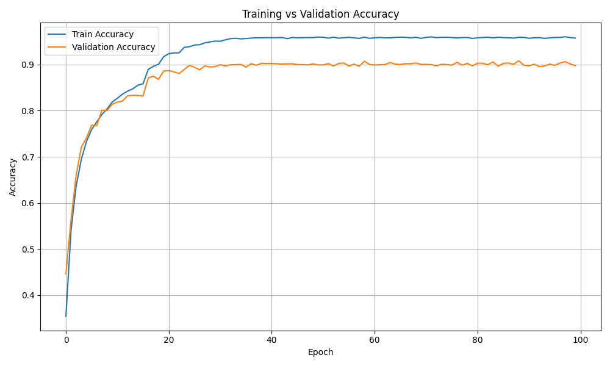
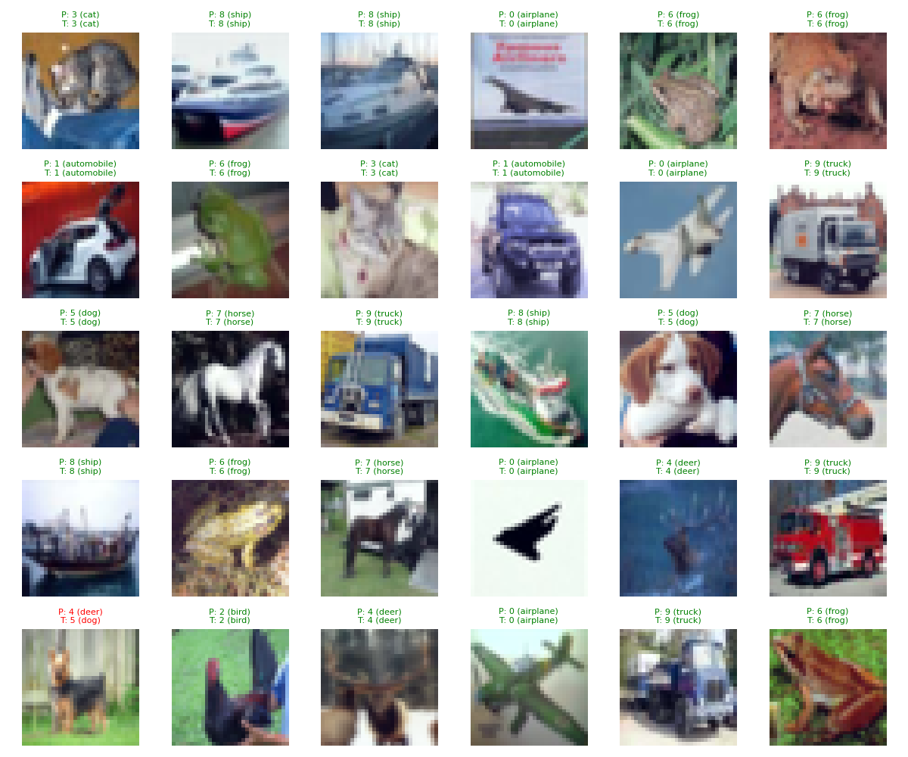
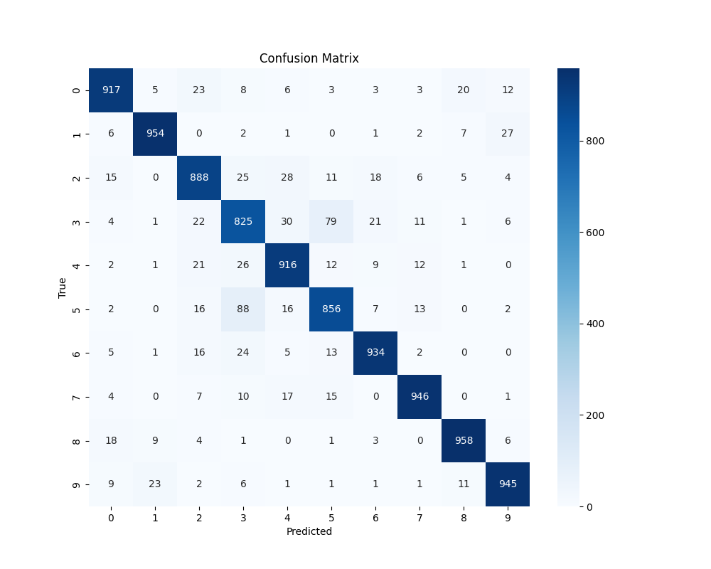

# Deep Learning for Embedded Device Deployment

## Overview
This project focuses on the **development, training, evaluation, and deployment of lightweight deep learning models** optimized for **resource-constrained embedded devices**.  

Key features:

- **Model Training**: Modified MobileNetV2 architecture for small input sizes, supporting CPU/GPU training.  
- **Testing & Evaluation**: CPU-based evaluation using accuracy, confusion matrices, classification predictions, and inference latency.  
- **Post-Training Quantization (PTQ)**: Reduces model size and improves inference speed on embedded devices with minimal accuracy loss.  
- **Dataset**: CIFAR-10  
- **Deployment-Ready**: TorchScript models suitable for Raspberry Pi, NVIDIA Jetson, or similar platforms.

This repository demonstrates a complete workflow from **model design to embedded deployment**, highlighting **efficient computation and low-memory usage**, which is crucial for research in robotics and embedded AI.

---

## Repository Structure
```bash
Scripts/
│
├── main.py                 # Entry point for training, testing, quantization
├── train.py                # Model training module
├── test.py                 # Evaluation and testing utilities
├── quantize_model.py       # Post-training quantization pipeline
├── data_loader.py          # Dataset loading utilities
├── model_network.py        # Model architecture (MobileNetV2)
├── helpers/                # Helper functions
│   ├── global_import.py
│   └── quantize_helper.py

```
## Installation

Follow the steps below to set up the required Python environment and install the dependencies.
1. Navigate to the project directory:
```bash
cd /path/to/this/project
```
2. Create and activate a Python virtual environment:
```bash
# Recommended
    python3 -m venv pytorch_env
    # ubuntu
    source pytorch_env/bin/activate
    # Windows CMD
    pytorch_env\Scripts\activate.bat
    # Windows PowerShell
    pytorch_env\Scripts\Activate.ps1
```

3. Install dependencies:
```bash
# Note: the packages are that are used for testing and should work for lower version of torch too!
pip install -r requirements.txt

```


## Usage
```bash 
# ==========================================
#               PROJECT USAGE
#   (Training, Testing, Quantization Pipeline)
# ==========================================

# ------------------------------------------
# 1. TRAINING
# ------------------------------------------
# Trains 
# - Downloads dataset on first run
# - Logs training/validation loss & accuracy
# - Saves training log to:   media/training_log.txt
# - Saves trained model to:  models/final_model.pth

python3 Scripts/main.py train

# Visualize logs after training:
# - Plots loss curves
# - Plots accuracy curves
python3 Scripts/plot_log.py

# ------------------------------------------
# 2. TESTING
# ------------------------------------------
# Evaluates the trained model on CIFAR-10 test set.
# Produces:
# - Overall accuracy
# - Classification report
# - Confusion matrix
# - Inference latency (batch & per-image)
# Saves results to: media/test_log.txt
python3 Scripts/main.py test

# ------------------------------------------
# 3. POST-TRAINING QUANTIZATION (PTQ)
# ------------------------------------------
# Runs quantization on the trained model.
# Produces:
# - Quantized model (models/quantized_model.pth)
# - Model size comparison
# - Latency comparison (FP32 vs INT8)
# - Accuracy comparison
# Saves comparison log to: media/comparison_log.txt

python3 Scripts/main.py quantize

# ------------------------------------------
# 4. CHAINED WORKFLOWS
# ------------------------------------------

# Train → Test
# (Complete pipeline for performance evaluation)
python3 Scripts/main.py train test

# OR

# Train → Quantize
# (Complete pipeline for optimizing deployed models)
python3 Scripts/main.py train quantize
```


## Configuration Parameters
All parameters can be modified in ```config.yaml``` and can be adjusted as required.
```yaml
data_dir: Dataset
batch_size: 64
n_calib_batch: 32
num_epochs: 2
learning_rate: 0.01
alpha: 1.0
media_log_dir: media
model_log: training_log.txt
test_log: test_log.txt
val_split: 0.1
num_workers: 4
visualize_losses: true
visualize_accuracies: true
models_dir: models
compare_models: true
num_runs_latency: 5
comparison_log_name: comparison_log.txt
trained_model_name: final_model.pth
quantized_model_name: quantized_model.pth
quantization: false 
```
# Results

## 1. Training Curve (Accuracy & Loss)

The training and validation performance of the model is shown below.

<table>
<tr>
<td align="center">
  <b>Training/Validation Accuracy</b><br>
  
</td>
<td align="center">
  <b>Training/Validation Loss</b><br>
  
</td>
</tr>
</table>

</div>

## Sample Predictions & Confusion Matrix

Below are example predictions and the confusion matrix for CIFAR-10 test images.

<table>
<tr>
<td align="left">
  <b>Sample Predictions</b><br>
  
</td>
<td align="right">
  <b>Confusion Matrix</b><br>
  
</td>
</tr>
</table>


## 4. Model Comparison Summary

| Metric                | Full-Precision Model | Quantized (PTQ) Model | Change |
|----------------------|----------------------|------------------------|--------|
| **Accuracy**         | 0.9139               | 0.9125                 | ↓ 0.15% |
| **Model Size (MB)**  | 9.2820               | 2.6434                 | ↓ 71.52% |
| **Latency / Batch(32) (s)** | 0.5283            | 0.2276                 | ↓ 56.92% |
| **Latency / Image (s)** | 0.0165            | 0.0071                 | ↓ 56.92% |


<div align="right">
<b>@Nov, 2025!!!<br>
Goitom</b>
</div>
